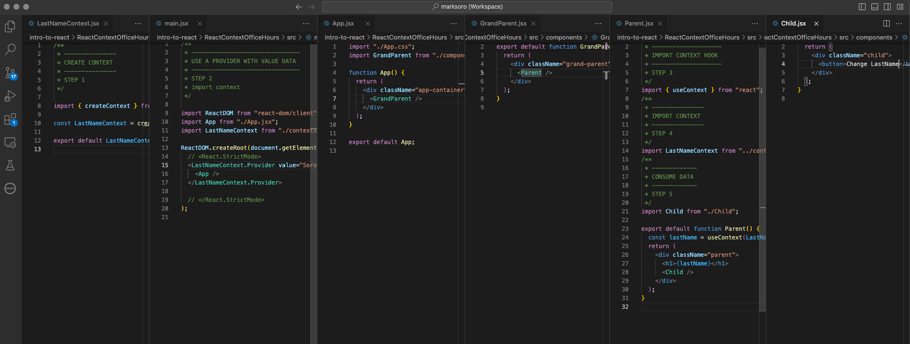
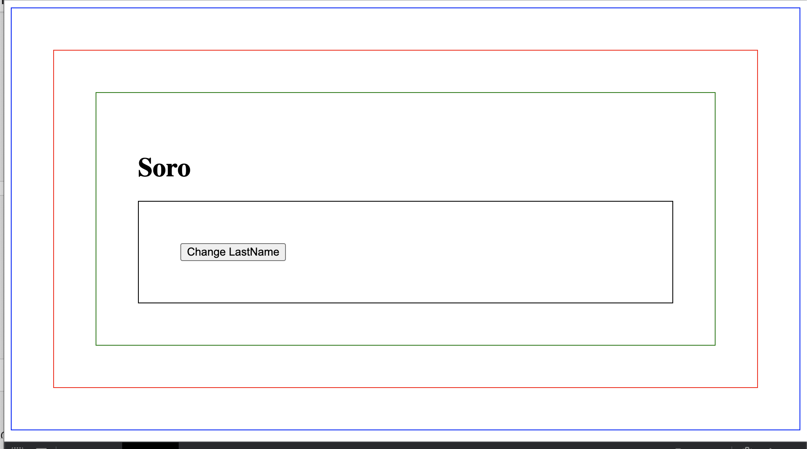

# React Context

Demonstration of createContext and useContext





```jsx
// context file
/**
 * -----------------------
 * STEP 1: CREATE CONTEXT
 * -----------------------
 * from contexts/LastNameContext.jsx
 */
import { createContext } from "react";

const LastNameContext = createContext();

export default LastNameContext;
```

```jsx
// main.jsx
import ReactDOM from "react-dom/client";
import App from "./App.jsx";
import LastNameContext from "./contexts/LastNameContext";
/**
 * -----------------------------------------
 * STEP 2. USE A PROVIDER WITH A VALUE DATA
 * -----------------------------------------
 */
ReactDOM.createRoot(document.querySelector("#root")).render(
  <LastNameContext.Provider value="Soro">
    <App />
  </LastNameContext.Provider>
);
```

```jsx
// App.jsx
import "./App.css";
import GrandParent from "./components/GrandParent";

const App = function () {
  return (
    <div className="app-container">
      <GrandParent />
    </div>
  );
};

export default App;
```

```jsx
// GrandParent.jsx
import Parent from "./Parent";

export default function GrandParent() {
  return (
    <div className="grand-parent">
      <Parent />
    </div>
  );
}
```

```jsx
// Parent.jsx
/**
 * -------------------------------
 * STEP 3. IMPORT USECONTEXT HOOK
 * -------------------------------
 */
import { useContext } from "react";
/**
 * -----------------------
 * STEP 4. IMPORT CONTEXT
 * -----------------------
 */
import LastNameContext from "../contexts/LastNameContext";

import Child from "./Child";
/**
 * -------------------------
 * STEP 5. CONSUME THE DATA
 * -------------------------
 */
export default function Parent() {
  const lastName = useContext(LastNameContext);
  return (
    <div className="parent">
      <h1>{lastName}</h1>
      <Child />
    </div>
  );
}
```

```jsx
// Child.jsx
export default function Child() {
  return (
    <div className="child">
      <button>Change LastName</button>
    </div>
  );
}
```
